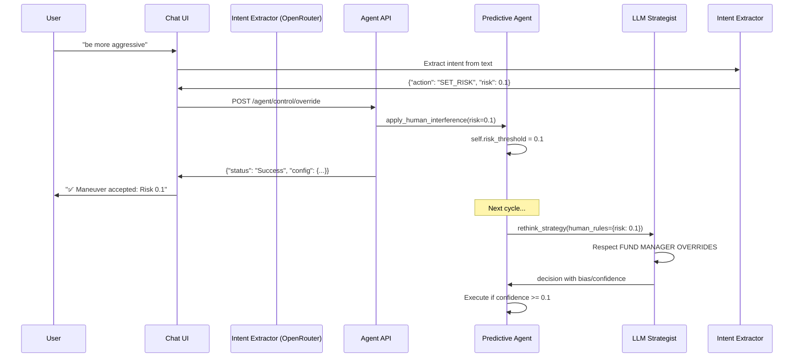

# C2 Bridge Implementation Summary

## ✅ Implementation Complete

The real-time chat-to-agent Command & Control (C2) bridge has been fully implemented across your stack.

## 🎯 What Was Built

### 1. **Agent State Awareness** (`agent/predictive_agent.py`)
- ✅ Added `self.risk_threshold` (default 0.15)
- ✅ Added `self.forced_bias` (default None)
- ✅ Implemented `apply_human_interference(risk, bias)` method
- ✅ Integrated `human_rules` dictionary into `run_cycle()`
- ✅ Passed overrides to strategist LLM on every decision cycle

### 2. **Strategist Override Logic** (`agent/tools.py`)
- ✅ Updated `rethink_strategy()` to accept `human_rules` parameter
- ✅ Added `## FUND MANAGER OVERRIDES` section to LLM prompt
- ✅ Enforced logic: forced_bias SHORT forbids LONG (and vice versa)
- ✅ Made overrides non-negotiable and highest priority

### 3. **Backend Control API** (`agent/api.py`)
- ✅ Created `POST /agent/control/override` endpoint
- ✅ Accepts JSON: `{"risk": 0.1, "bias": "SHORT"}`
- ✅ Updates global agent instance in real-time
- ✅ Returns current configuration after each override

### 4. **Chat Intent Extraction** (`frontend/app/api/chat/route.ts`)
- ✅ Implemented `extractIntent()` using OpenRouter's gpt-4o-mini
- ✅ Mapped natural language to structured commands:
  - "be aggressive" → `{"action": "SET_RISK", "risk": 0.1}`
  - "go short" → `{"action": "SET_BIAS", "bias": "SHORT"}`
  - "AI discretion" → `{"action": "SET_BIAS", "bias": "NONE"}`
- ✅ Routed intents to appropriate API endpoints
- ✅ Display confirmation messages in chat UI

### 5. **Execution Layer** (Already Implemented)
- ✅ `execute_move()` calls `self.engine.execute_swap()`
- ✅ Uses WalletManager for real blockchain transactions
- ✅ DataPipeline uses x402 payment proofs via `fetch_with_proof()`

## 📁 Files Modified

| File | Changes |
|------|---------|
| `agent/predictive_agent.py` | Added state variables, `apply_human_interference()`, human_rules integration |
| `agent/tools.py` | Enhanced LLM prompt with override section, updated method signature |
| `agent/api.py` | Simplified `/agent/control/override` to use `apply_human_interference()` |
| `frontend/app/api/chat/route.ts` | Complete rewrite with intent extraction and routing logic |

## 📁 Files Created

| File | Purpose |
|------|---------|
| `C2_BRIDGE_IMPLEMENTATION.md` | Complete documentation and usage guide |
| `test_c2_bridge.sh` | Automated integration test script |

## 🧪 Testing Instructions

### Quick Verification
```bash
# 1. Ensure agent is running
cd agent && python -m agent.main

# 2. Run test suite
./test_c2_bridge.sh

# 3. Check current override status
./check_override_status.sh
```

### Manual Testing via Chat
1. Start frontend: `cd frontend && npm run dev`
2. Open: `http://localhost:3600`
3. Type: **"be extremely aggressive"**
4. Expected response:
   ```
   ✅ Maneuver accepted:
   • Risk Threshold: 0.1
   • Bias: AI Discretion
   • Status: Active
   ```

### Manual Testing via API
```bash
# Set aggressive + short bias
curl -X POST http://localhost:8000/agent/control/override \
  -H "Content-Type: application/json" \
  -d '{"risk": 0.1, "bias": "SHORT"}'

# Reset to AI discretion
curl -X POST http://localhost:8000/agent/control/override \
  -H "Content-Type: application/json" \
  -d '{"risk": 0.15, "bias": "NONE"}'
```

## 🔄 How It Works



## 🎯 Command Reference

| Natural Language | API Payload | Effect |
|------------------|-------------|--------|
| "be aggressive" | `{"risk": 0.1}` | Lowers execution threshold to 0.1 |
| "be conservative" | `{"risk": 0.85}` | Raises execution threshold to 0.85 |
| "go short" | `{"bias": "SHORT"}` | Forces SHORT-only trades |
| "go long" | `{"bias": "LONG"}` | Forces LONG-only trades |
| "neutral stance" | `{"bias": "NEUTRAL"}` | Blocks all trades |
| "AI discretion" | `{"bias": "NONE"}` | Clears directional override |
| "reset defaults" | `{"risk": 0.15, "bias": "NONE"}` | Returns to institutional defaults |

## 🔒 Security Notes

**Current Implementation:**
- ✅ Real-time state injection
- ✅ Backward compatible with ENV overrides
- ⚠️ No authentication on `/agent/control/override`

**Production Recommendations:**
1. Add JWT authentication to override endpoint
2. Implement rate limiting
3. Add audit logging for all override commands
4. Require multi-factor confirmation for aggressive settings
5. Add role-based access control (RBAC)

## 📊 Monitoring

### Agent Logs
Watch for these indicators that overrides are working:
```
🎯 [Human Override] Threshold: 0.10 | Bias: SHORT
[C2] Human override: Setting risk_threshold to 0.1
[C2] Human override: Setting forced_bias to SHORT
```

### LLM Prompt
Verify the strategist receives overrides:
```
## FUND MANAGER OVERRIDES (HIGHEST PRIORITY)
- forced_bias: SHORT
- risk_threshold: 0.1
```

### Execution Layer
Confirm trades execute with new thresholds:
```
🚀 [EXECUTION] Action: SHORT | Confidence: 0.35 | Threshold: 0.10
   (Would have been skipped with default 0.15 threshold)
```

## 🚀 Next Steps

1. **Test in Local Environment:**
   ```bash
   ./test_c2_bridge.sh
   ```

2. **Verify Live Override:**
   - Open chat interface
   - Issue "be aggressive" command
   - Watch agent logs for confirmation
   - Run `./check_override_status.sh`

3. **Trigger Trade:**
   ```bash
   ./test_buy.sh
   # OR wait for next agent cycle (15s)
   ```

4. **Confirm Obedience:**
   - Check agent executed despite lower confidence
   - Verify blockchain transaction on Etherlink
   - Confirm override persists across cycles

## 🎓 Additional Resources

- [Full Implementation Guide](C2_BRIDGE_IMPLEMENTATION.md)
- [Real-Time Override System](REAL_TIME_OVERRIDE_SYSTEM.md)
- [Override Quick Reference](OVERRIDE_QUICK_REF.md)
- [Force Scripts](force_aggressive.sh) - Legacy shell-based overrides

## ✨ Key Features

- ✅ **Natural Language Control**: "be aggressive" → instant threshold adjustment
- ✅ **Real-Time Updates**: No agent restart required
- ✅ **Persistent State**: Overrides survive across cycles
- ✅ **LLM Enforcement**: Fund Manager commands override AI logic
- ✅ **UI Feedback**: Chat displays confirmation messages
- ✅ **Status Verification**: `check_override_status.sh` script
- ✅ **Backward Compatible**: Works with existing ENV overrides
- ✅ **Type Safe**: Validates risk (0.0-1.0) and bias values

---

**Implementation Status:** ✅ **COMPLETE**  
**Ready for Testing:** ✅ **YES**  
**Production Ready:** ⚠️ **Requires Authentication**
